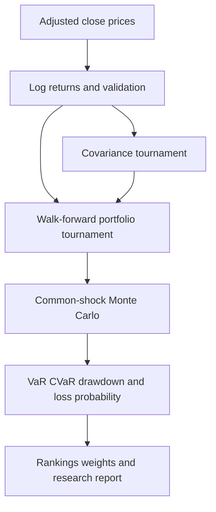
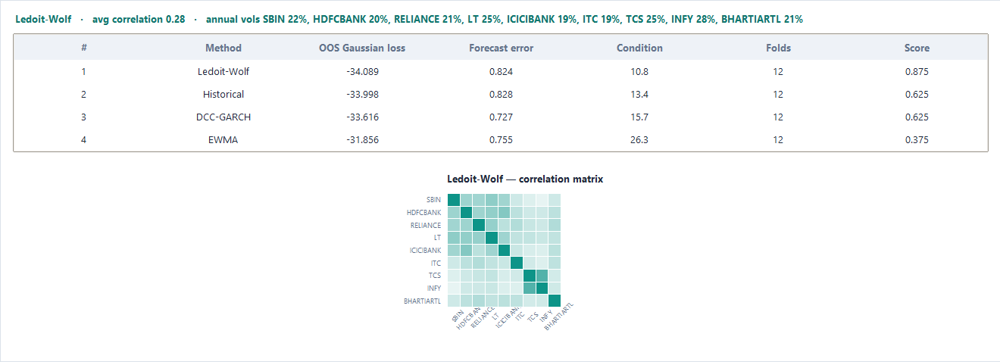
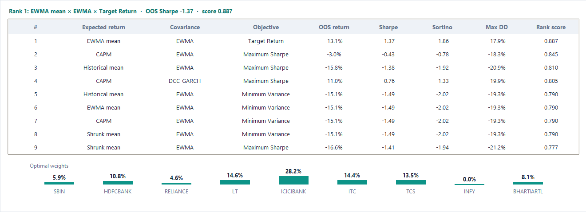
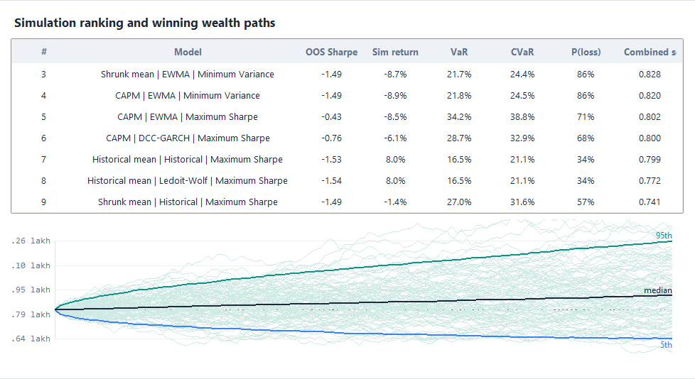
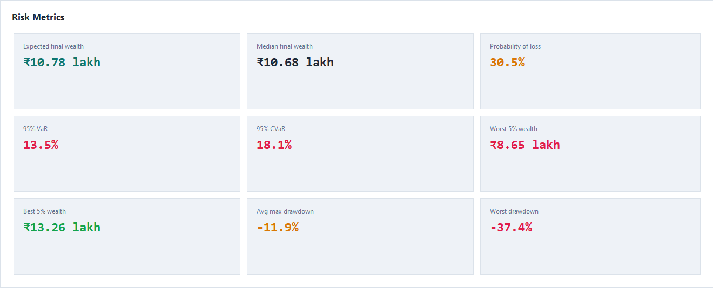
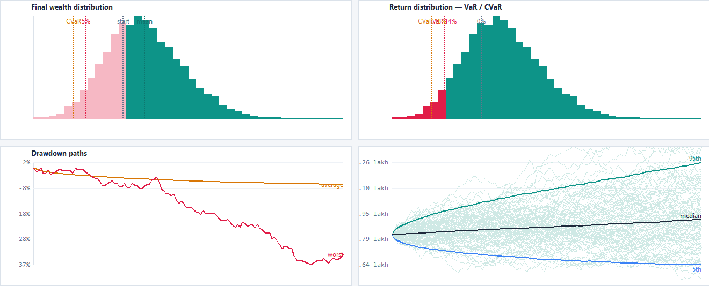

# Portfolio Model Tournament and Monte Carlo Risk Engine

A reproducible quantitative-research pipeline that compares covariance estimators, expected-return models, and portfolio objectives before evaluating every candidate through Monte Carlo risk simulation.

The project deliberately separates three questions:

1. Which covariance estimator forecasts dependence most reliably?
2. Which complete portfolio specification performs best in rolling out-of-sample tests?
3. How does each ranked portfolio behave across thousands of comparable future scenarios?

## Research workflow



## Model universe

| Component | Alternatives |
|---|---|
| Expected returns | Historical mean, EWMA mean, CAPM, shrunk mean |
| Covariance | Historical, EWMA, Ledoit-Wolf, DCC-GARCH |
| Objective | Maximum Sharpe, minimum variance, target return |

The engine evaluates all **48 combinations** using rolling walk-forward validation. Transaction costs are deducted whenever portfolio weights change.

## Key features

- Out-of-sample covariance ranking using Gaussian forecast loss, covariance error, and matrix conditioning
- Rolling portfolio re-estimation rather than a single in-sample fit
- Sharpe, Sortino, annualized return, volatility, drawdown, turnover, tail loss, and effective holdings
- Common random numbers for fair Monte Carlo comparison
- 95% VaR and CVaR, loss probability, and simulated return
- Deterministic seeds and CSV exports for reproducibility
- Explicit separation between relative ranking and absolute investment quality

## Results interface

### Covariance selection



Ledoit-Wolf ranked first in the illustrated run because it combined the strongest Gaussian forecast loss with the best numerical conditioning. DCC-GARCH produced the lowest raw covariance error, showing why the winner depends on the complete scoring rule rather than one metric.

### Walk-forward optimizer ranking



The optimizer ranks all return, covariance, and objective combinations. A high rank score is relative: negative out-of-sample Sharpe ratios remain negative evidence even when one candidate ranks above the others.

### Monte Carlo comparison



Every model receives the same random shock matrix. This reduces simulation noise when comparing candidates and makes the relative ranking more defensible.

### Risk dashboard





## Installation

```bash
git clone https://github.com/YOUR_USERNAME/portfolio-model-tournament.git
cd portfolio-model-tournament
python -m venv .venv
```

Activate the environment and install dependencies:

```bash
pip install -r requirements.txt
```

## Usage

Run the reproducible demonstration:

```bash
python main.py
```

Run with a price CSV:

```bash
python main.py --prices data/prices.csv --capital 1000000 --horizon 252 --simulations 10000
```

The CSV must contain a date index followed by one adjusted-close column per asset.

Generated files:

- `outputs/covariance_ranking.csv`
- `outputs/model_ranking.csv`
- `outputs/simulation_ranking.csv`
- `outputs/winner.json`

## Repository structure

```text
portfolio-model-tournament/
├── main.py
├── src/
│   └── portfolio_research.py
├── tests/
│   └── test_pipeline.py
├── assets/screenshots/
├── docs/
│   ├── RESEARCH_REPORT.md
│   └── Portfolio_Model_Tournament_Research_Report.docx
├── outputs/
├── requirements.txt
├── LICENSE
└── README.md
```

## Interpreting the illustrated result

The illustrated simulation winner produced expected final wealth of ₹10.78 lakh from ₹10 lakh, with 13.5% VaR, 18.1% CVaR, and a 30.5% estimated probability of finishing below the initial capital. Its walk-forward Sharpe ratio remained negative. The correct conclusion is therefore **highest-ranked research candidate**, not **validated profitable strategy**.

## Research limitations

- Expected returns are unstable and estimation-sensitive.
- Gaussian simulation can understate jumps and extreme dependence.
- Rankings depend on the chosen sample and scoring weights.
- Model comparison does not remove regime risk or structural breaks.
- The program is a research and educational system, not execution software or investment advice.

## Author

Ashish Kumar A

## License

MIT License
